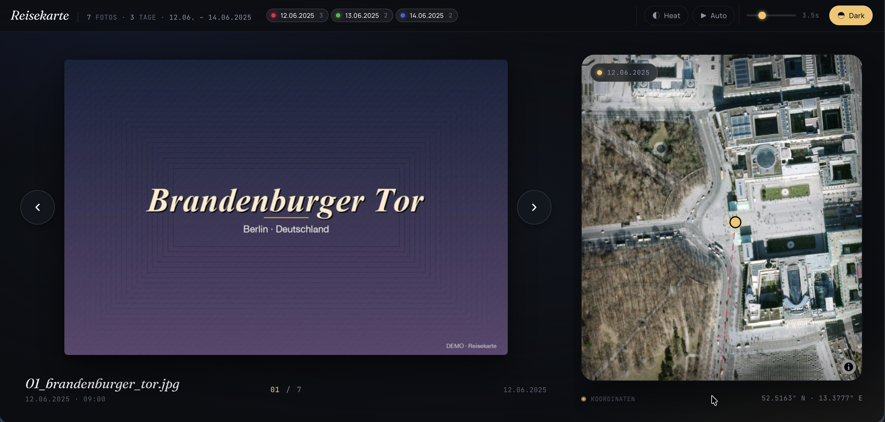

# Reisekarte – Photo Travel Map

> Generiere aus deinen Reisefotos eine interaktive 3D-Karte. **Komplett lokal** – kein Account, keine Cloud, kein Upload.

Ein Python-Skript, das die GPS-EXIF-Daten deiner Fotos liest und daraus eine elegante, in sich geschlossene HTML-Datei erzeugt: links ein Foto-Viewer im Travel-Magazine-Look, rechts ein 3D-Globus mit Markern für jeden Aufnahmeort und farbigen Pfaden pro Reisetag.



---

## Features

- 📍 **3D-Globus** (MapLibre) mit Markern, animierten Tagespfaden und Heatmap-Toggle
- 🖼 **Foto-Viewer** mit Crossfade, Tastatur-Navigation (← / →), Auto-Play und Geschwindigkeits-Slider
- 🎨 **Tag-Pills**: Pro Reisetag eine Farbe – einzelne Tage ein-/ausblendbar
- 🛰 **Karten-Stil-Toggle**: Dark-Map ↔ Satellitenbild
- 📦 **Self-contained**: Eine einzelne `reisekarte.html`, alle Fotos als Base64 eingebettet
- 🔒 **Lokal-only**: Skript greift ausschließlich auf den `fotos/`-Ordner im Repo zu
- 🖱 **Doppelklick-Start**: Wrapper-Skripte für Windows, macOS und Linux – kein Terminal nötig

## Voraussetzungen

- **Python 3.10** oder neuer (3.13 empfohlen)
- **Desktop oder Laptop** (Windows, macOS, Linux) – nicht für Smartphone optimiert
- Eigene Fotos mit **GPS-EXIF-Daten** (Standortzugriff bei der Aufnahme aktiv)
- Aktueller Browser (Chrome, Firefox, Safari, Edge)

---

## ⚡ Schnellstart per Doppelklick (empfohlen)

Der einfachste Weg, ohne sich mit Terminal-Befehlen auseinandersetzen zu müssen.

1. **Repo herunterladen** ([ZIP-Download](https://github.com/Niwo911/Reisekarte/archive/refs/heads/main.zip)) und entpacken
2. **Eigene Fotos** in den Ordner `fotos/` legen (oder erstmal mit den mitgelieferten Demo-Bildern testen)
3. **Doppelklick auf:**
   - 🪟 **Windows:** `Windows_Reisekarte_erstellen.bat`
   - 🍎 **macOS:** `Mac_Linux_Reisekarte_erstellen.command`
   - 🐧 **Linux:** `Mac_Linux_Reisekarte_erstellen.command` (einmalig im Terminal `chmod +x` ausführen)

Beim ersten Start werden Python-Dependencies automatisch installiert (~1 Min). Danach öffnet sich die fertige Karte direkt im Browser.

> **Falls Python fehlt**, zeigt das Skript dir den passenden Installationsweg an.

> **macOS-Hinweis:** Beim ersten Doppelklick auf `.command` erscheint eventuell „Datei aus dem Internet". Mit „Öffnen" bestätigen. Falls Gatekeeper komplett blockiert: Rechtsklick → „Öffnen" → „Öffnen".

> **Windows-Hinweis:** SmartScreen kann beim ersten Mal warnen. Auf „Weitere Informationen" klicken → „Trotzdem ausführen".

---

## 🚦 Vor dem Start (für Einsteiger)

Falls du Begriffe wie „Terminal" oder „Python" noch nie gehört hast, hier das Nötigste in 2 Minuten.

### 💻 Terminal / Eingabeaufforderung öffnen

Hier tippst du gleich die Befehle ein.

- **macOS**: `Cmd` + `Leertaste` → „Terminal" eintippen → Enter
- **Windows**: Startmenü → „PowerShell" oder „Eingabeaufforderung" suchen
- **Linux**: meist `Strg` + `Alt` + `T`

### 🐍 Python installieren (falls noch nicht vorhanden)

Erst prüfen, ob Python schon da ist. Im Terminal eintippen:

```bash
python3 --version
```

Erscheint eine Version `Python 3.10.x` oder höher → ✅ fertig, weiter zum Schnellstart.

Sonst installieren:

- **macOS**: [python.org/downloads](https://www.python.org/downloads/) → Installer für macOS herunterladen und durchklicken
  *Oder mit [Homebrew](https://brew.sh/): `brew install python`*
- **Windows**: [Microsoft Store](https://apps.microsoft.com/) öffnen → nach „Python 3.13" suchen → Installieren *(einfachster Weg, kein PATH-Setup nötig)*
  *Oder von [python.org/downloads](https://www.python.org/downloads/) — wichtig: Beim Installer **„Add Python to PATH"** ankreuzen!*
- **Linux**: meist schon dabei. Sonst `sudo apt install python3 python3-venv python3-pip`

### 🍎 Nur für macOS mit Apple Silicon (M1/M2/M3 usw.)

Damit HEIC-Fotos vom iPhone gelesen werden können, einmalig:

```bash
brew install libheif
```

(Ohne diesen Schritt scheitert manchmal die `pillow-heif`-Installation.)

---

## 🛠 Manueller Start (für Entwickler)

```bash
# 1. Repo klonen
git clone https://github.com/Niwo911/Reisekarte.git
cd Reisekarte

# 2. Dependencies installieren
python3 -m venv venv
source venv/bin/activate          # Windows: venv\Scripts\activate
pip install -r requirements.txt

# 3. Skript ausführen (nutzt zunächst die mitgelieferten Demo-Bilder)
python foto_karte.py

# 4. Ergebnis im Browser öffnen
open reisekarte.html              # macOS
# oder Doppelklick auf reisekarte.html im Datei-Explorer
```

---

## 📖 Schritt-für-Schritt-Anleitung

### 1. Repo herunterladen

**Mit Git:**
```bash
git clone https://github.com/Niwo911/Reisekarte.git
cd Reisekarte
```

**Ohne Git:** Auf GitHub oben rechts auf den grünen **Code**-Button klicken → **Download ZIP** → ZIP entpacken.

### 2. Eigene Fotos einfügen

Lege deine Fotos in den Ordner **`fotos/`** (im Repo-Verzeichnis). Du kannst Unterordner anlegen – das Skript durchsucht den Ordner rekursiv.

Die mitgelieferten Demo-Bilder kannst du
- **behalten**, um sie zusammen mit deinen Fotos auf der Karte zu sehen, oder
- **löschen**, um nur deine eigenen Fotos darzustellen.

> ✅ Nur der `fotos/`-Ordner wird gelesen. Das Skript greift auf **keinen** anderen Pfad auf deinem Computer zu und schreibt **nur** die `reisekarte.html` daneben.

### 3. Skript starten

**Empfohlen:** Doppelklick auf das passende Wrapper-Skript (siehe Schnellstart oben).

**Manuell im Terminal:**
```bash
python foto_karte.py
```

Optional: anderen Ordner als Quelle nutzen:
```bash
python foto_karte.py /pfad/zu/anderem/ordner
```

### 4. Karte öffnen und nutzen

Doppelklick auf **`reisekarte.html`** öffnet sie im Browser.

**Bedienung:**
- `←` / `→` – vorheriges / nächstes Foto
- `Leertaste` – Auto-Play starten/stoppen
- Pfeil-Buttons links/rechts – wie Tastatur
- Tag-Pills oben – einzelne Tage ein-/ausblenden
- **Heat** – Heatmap-Modus
- **Auto** – Auto-Play (Geschwindigkeits-Slider daneben)
- **Satellit / Dark** – Karten-Stil umschalten
- Marker auf der Karte direkt anklickbar

---

## 📸 Fotos vom iPhone exportieren

1. **Fotos auf den Mac übertragen**
   iPhone per USB-Kabel anschließen *oder* iCloud-Fotos aktivieren (*Einstellungen → [Dein Name] → iCloud → Fotos*).

2. **Fotos-App auf dem Mac öffnen**
   Gewünschte Fotos auswählen (z. B. nach Datum filtern in der Seitenleiste, dann mit `Cmd + A` alle markieren).

3. **Originale exportieren**
   Menü **Ablage → Exportieren → „Originale unverändert exportieren"** wählen.
   Das stellt sicher, dass die GPS-Metadaten erhalten bleiben.

4. **Zielordner festlegen**
   Einen Ordner auswählen – am einfachsten direkt den `fotos/`-Ordner in diesem Repo.

5. **Optional: Live-Photo-Videos entfernen**
   Im Zielordner oben rechts ins Suchfeld `kind:movie` eingeben, alle `.mov`-Dateien markieren und löschen.

### Android-Nutzer

Fotos vom Smartphone in den `fotos/`-Ordner kopieren. Das Skript funktioniert genauso, sofern die Bilder GPS-EXIF-Daten enthalten.

### Windows-Nutzer (iPhone via Kabel)

Beim Anschließen des iPhones erscheint es als Wechseldatenträger. Den Ordner `Internal Storage\DCIM` öffnen und Fotos kopieren. Wichtig: In den iPhone-Einstellungen unter *Fotos → Auf Mac/PC übertragen* die Option **„Originale beibehalten"** aktivieren, sonst wird beim Übertragen konvertiert und EXIF kann verloren gehen.

---

## ⚠️ Hinweise

- **Bei vielen Fotos kann das Erzeugen mehrere Minuten dauern** – jedes Bild wird gelesen, EXIF geparst, ein Thumbnail erzeugt und Base64-kodiert eingebettet.
- **Die generierte `reisekarte.html` kann groß werden** – bei vielen Fotos schnell mehrere hundert MB. Sie liegt aber nur lokal auf deinem Rechner.
- **iOS Live Photos** werden nicht unterstützt – die `.mov`-Begleitdateien werden ignoriert. Am besten vor dem Import löschen (siehe Punkt 5 oben).
- **Screenshots, AirDrop- und Messenger-Fotos** enthalten meist keine GPS-Daten und werden übersprungen.
- **Unterstützte Formate:** `JPG`, `JPEG`, `HEIC`, `HEIF`, `PNG`, `TIFF`.
- **Erste Karten-Tile-Ladung benötigt Internet** – die HTML lädt beim ersten Öffnen MapLibre + die Karten-Tiles von OpenFreeMap/Esri. Danach ist das Foto-Browsen offline möglich.

---

## 🔒 Datenschutz & Sicherheit

- Das Skript liest **ausschließlich** den `fotos/`-Ordner im Repo.
- Während der Verarbeitung werden **keine Daten ins Internet gesendet**.
- Die generierte `reisekarte.html` enthält deine **GPS-Koordinaten und Fotos eingebettet**. Teile sie nur, wenn du das bewusst möchtest.
- Beim Öffnen der HTML im Browser werden Karten-Tiles von **OpenFreeMap** (Dark-Style) und **Esri** (Satellit) sowie Schriften von **Google Fonts** geladen. Diese Drittanbieter sehen deine IP-Adresse, aber **keine Foto- oder GPS-Daten**.
- Das `.gitignore` ist so konfiguriert, dass deine eigenen Fotos in `fotos/` und die generierte HTML **nicht versehentlich** in einen Git-Commit landen.

---

## 🛠 Troubleshooting

**„Hinweis: 'pillow-heif' nicht installiert"**
HEIC-Dateien werden übersprungen. Lösung: `pip install pillow-heif`. Auf Apple Silicon ggf. zuerst Homebrew-`libheif` installieren: `brew install libheif`.

**„Keine GPS-Daten gefunden"**
Deine Fotos enthalten keine GPS-Koordinaten. Stelle sicher, dass beim Aufnehmen Standort-Zugriff erlaubt war. Screenshots, AirDrop-/Messenger-Fotos und manche bearbeitete Bilder verlieren EXIF-Daten.

**„Übersprungen: foo.jpg (...)"**
Einzelne Datei konnte nicht gelesen werden (kaputt, Live-Photo-`.mov`, kein EXIF, kein GPS). Das Skript läuft trotzdem für alle anderen Fotos durch.

**Karte zeigt nur grauen Hintergrund**
Erste Tile-Ladung braucht Internet. Browser neu laden oder Internetverbindung prüfen.

**HTML lässt sich nicht öffnen / öffnet als Quellcode**
Rechtsklick → *Öffnen mit* → Browser deiner Wahl wählen.

**Wrapper-Skript schließt sich sofort wieder (Windows)**
Im Datei-Explorer in der Adresszeile `cmd` eingeben → Enter → dann `Windows_Reisekarte_erstellen.bat` eintippen → Enter. So bleibt das Fenster offen und zeigt eventuelle Fehler.

---

## 🧪 Demo-Bilder neu erzeugen

Die mitgelieferten 7 Demo-Bilder (Brandenburger Tor, Markusplatz, Kolosseum, Akropolis, Sagrada Família, Eiffelturm, Big Ben) wurden synthetisch generiert. Das Skript dafür liegt unter `tools/generate_demo_fotos.py`.

Wer das Generieren reproduzieren oder anpassen möchte:

```bash
pip install Pillow piexif
python tools/generate_demo_fotos.py
```

---

## 📁 Projekt-Struktur

```
Reisekarte/
├── foto_karte.py              # Hauptskript
├── Windows_Reisekarte_erstellen.bat     # Doppelklick-Starter Windows
├── Mac_Linux_Reisekarte_erstellen.command # Doppelklick-Starter macOS / Linux
├── requirements.txt           # Python-Dependencies
├── README.md                  # diese Datei
├── LICENSE                    # MIT
├── .gitignore
├── fotos/                     # ← Hier deine Fotos hineinlegen
│   ├── 01_brandenburger_tor.jpg
│   ├── …
│   └── 07_big_ben.jpg
└── tools/
    └── generate_demo_fotos.py # Helper zum Erzeugen der Demo-Bilder
```

---

## 📜 Lizenz

[MIT](LICENSE) – frei nutzbar, modifizierbar und weitergebbar. Karten- und Schrift-Daten unterliegen den Lizenzen der jeweiligen Anbieter:
- [OpenFreeMap](https://openfreemap.org/) – ODbL für die Daten
- [Esri World Imagery](https://www.arcgis.com/home/item.html?id=10df2279f9684e4a9f6a7f08febac2a9) – Esri-Nutzungsbedingungen
- [Google Fonts](https://fonts.google.com/) – Open Font License
- [MapLibre GL JS](https://maplibre.org/) – BSD-3-Clause
